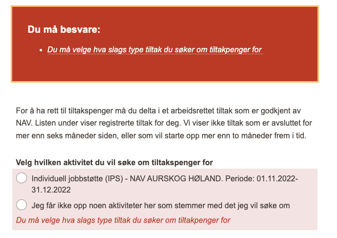

## Hva skjedde?

Tiltakspenger-vedtak var nede i 2,5 timer etter at det kom inn en søknad der hverken ArenaTiltak eller
BrukerregistrertTiltak var satt

## Hvilken effekt hadde det?

tiltakspenger-saksbehandler var utilgjengelig i dette tidsrommet og at innkomne søknader midlertidig ikke ble behandlet

## Hvordan oppdaget vi feilen

Kom varsel i tpts-varsel-prod

## Rotårsak til feilen

Søknaden så ut som følger. Her har søker på mystisk vis klart å _ikke_ velge det tiltaket hen går på.

```
    {
      "faktumId": xxx,
      "soknadId": xxx,
      "key": "tiltaksliste.valgtTiltak",
      "value": null,
      "properties": {},
      "type": "BRUKERREGISTRERT"
    },
    {
      "faktumId": xxx,
      "soknadId": xxx,
      "key": "tiltaksliste.tiltakFraArena",
      "value": "JOBBK",
      "properties": {
        "harSluttdatoFraArena": "true",
        "opprinneligsluttdato": "2022-12-15",
        "arenaId": "xxx",
        "startdato": "2022-11-28",
        "navn": "Jobbklubb",
        "erIEndreStatus": "false",
        "arrangoer": "KEOPS KURS OG ARBEIDSSENTER",
        "sluttdato": "2022-12-15",
        "opprinneligstartdato": "2022-11-28"
      },
      "type": "BRUKERREGISTRERT"
    },
```

Skal i teorien ikke være mulig å komme forbi dette steget uten å velge tiltak



## Læring

Søknaden er lunefull. Kan egentlig ikke stole på at noen av feltene er satt

## Hva gjorde vi bra

Oppdaget feilen tidlig. Alle bidro for å rette den. Rullet fremover

## Hva gjorde vi dårlig

Brukte litt lang tid, men det var greit siden vi ikke er fullt i produksjon ennå

## Hvordan hindrer vi at noe lignende skjer igjen? (tiltak)

- dele tiltakspenger-vedtak i en api del og en kafka del? (tiltak fra forrige post-mortem)
- ta eierskap til søknaden. I dag har vi liten kontroll på hva vi får og det er ikke lett å rette eventuelle feil
